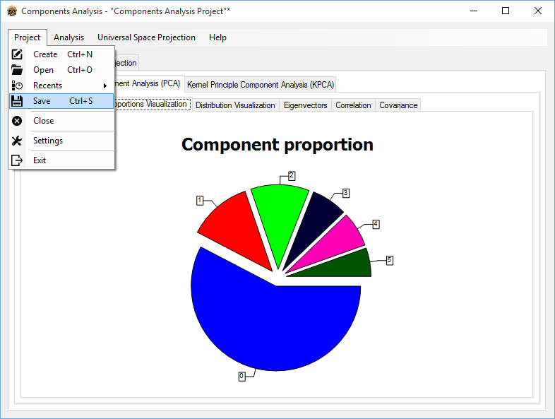

# Components-Analysis
Training application for performing Kernel/Principle Components Analysis.

Goals:
- Introduce working project lifecycle support (project creation, saving, opening, etc.)
- Implement system/user settings UI-based control support.
- Introduce English/Russian localization.

The components analysis itself had almost nothing to do with the primary objective I pursued: Improving programming and WinForms UI adjusting skills. Since K/PCA functionality was considered somewhat placeholding, I made extensive use of amazing [Accord.NET Machine Learning Framework](http://accord-framework.net/), [AForge.NET :: Framework](www.aforgenet.com/framework/) frameworks to implement it, so I give their developers much credit.
